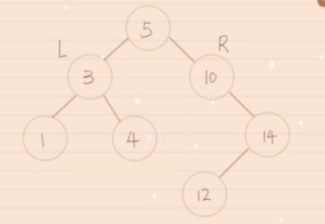
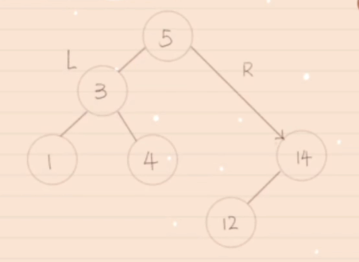
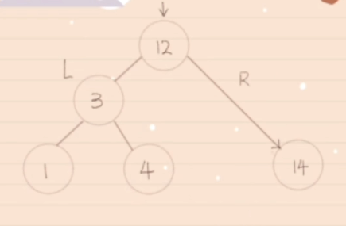
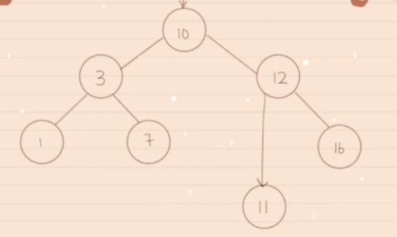
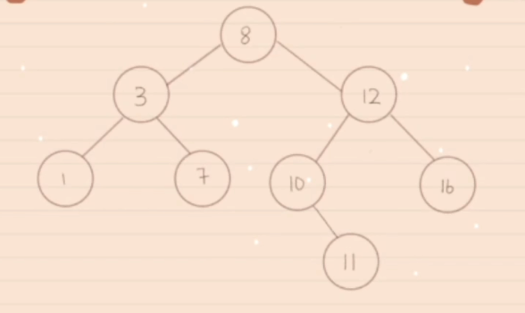

> https://www.bilibili.com/video/BV1i34y167sN/?spm_id_from=333.337.search-card.all.click&vd_source=3197f4d4146c7852700aecfaddba918c

### 一、no child（删除9）
直接删除

### 二、one child（删除10）
将5连接到10

### 三、two child（删除5）
将右侧最小的值移上来

### 四、复杂情况（基于三, 当右侧最小的值有右分支, 删除8）

删除8, 找到右侧最小值10, 发现10有右分支, 将12连接到11

