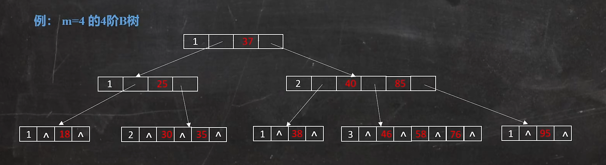

> B树是一个m叉树

#### m叉树要求
- 树中每个节点至多有m个孩子节点
- 树中每个节点至多有m-1个关键字
- 每个节点的结构为数组

    - |  n   | p0  | k1  | p1  | k2  | ...  | kn  | pn  |
      |  ----  | ----  | ----  | ----  | ----  | ----  | ----  | ----  |

    - n：第一个位置,表示此节点拥有多少个关键字
    - p0：表示第一个子树的地址
    - k1：标识第一个关键字
- 除根节点外, 其他节点至少有m/2子节点
- 若根节点不是叶子节点, 则根节点至少有两个孩子节点

#### 4阶B树
