> 平衡二叉树：左右节点层级树相差<2
> https://www.bilibili.com/video/BV16m4y1F7do/?spm_id_from=333.337.search-card.all.click&vd_source=3197f4d4146c7852700aecfaddba918c

## 第一题

- 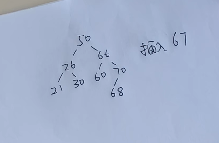

- 将67放入树内
  
  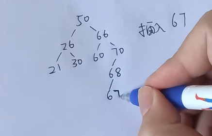
  
- 从67往上找, 直到发现不平衡树, 找到与根节点邻近的三个节点70 68 67, 重新排列, 替换进去

  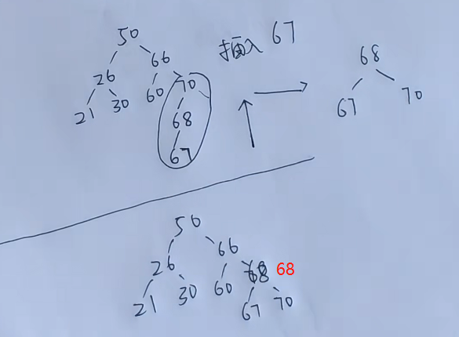

## 第二题

- 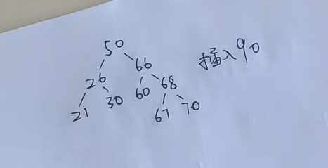

- 将90放入树内

- 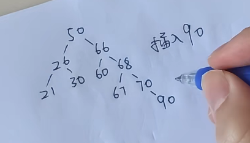

- 从90往上找, 直到发现不平衡树, 找到与根节点邻近的三个节点66 68 70
  
- 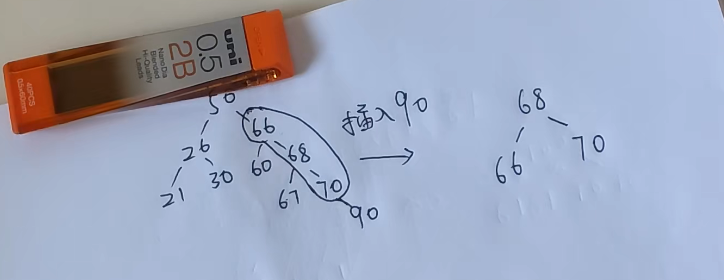

- 然后将此树上其他元素重新排列

- 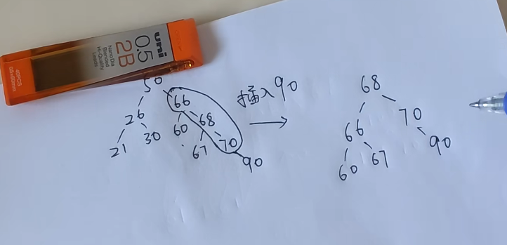

- 替换进去

- 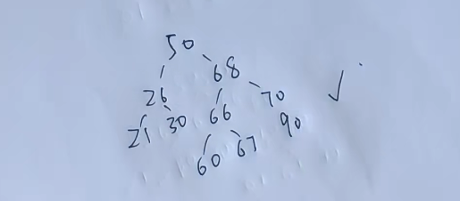

## 第三题

- 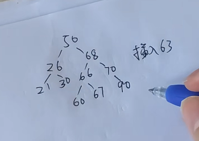

- 将63放入树内

- 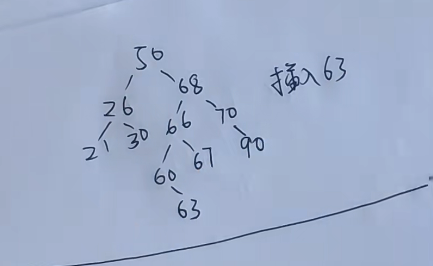

- 从63往上找, 发现直到根节点才是不平衡树, 找到50 68 66

- 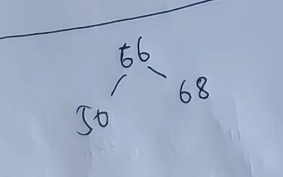

- 将与根节点有连接的节点原封不动移动, 将连接断开的节点放入新的平衡树

- 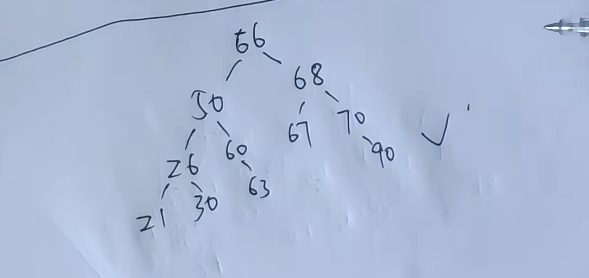

## 第四题

- 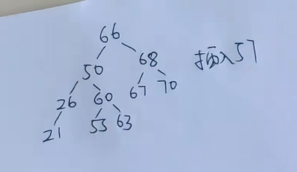

- 插入57

- 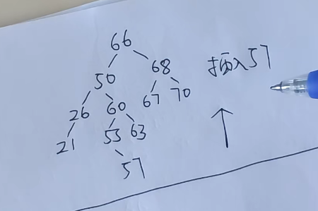

- 从63往上找, 发现直到根节点才是不平衡树, 找到66 50 60

- 